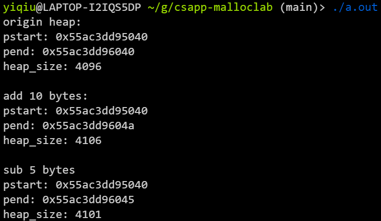
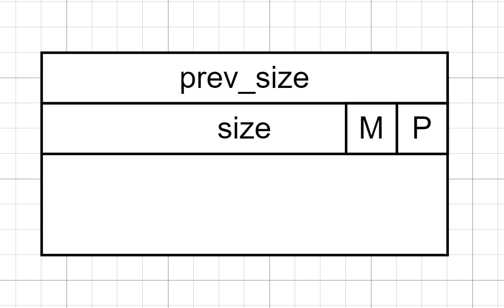
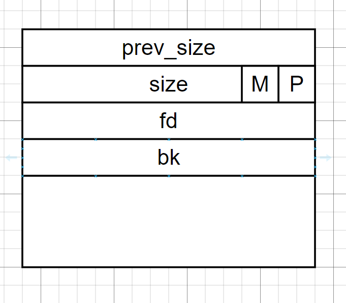
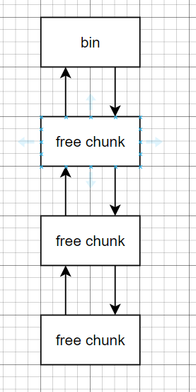
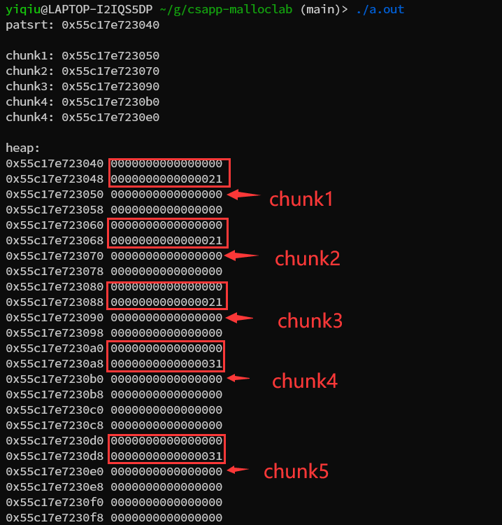
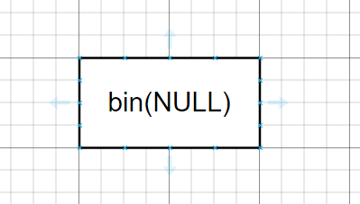
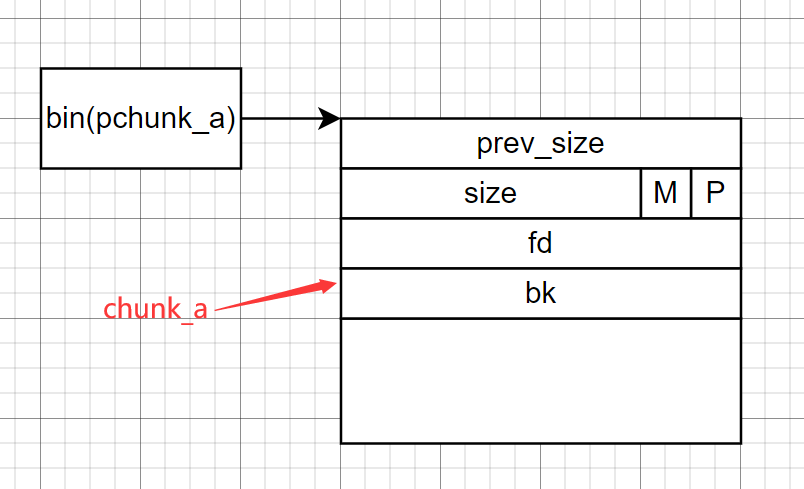
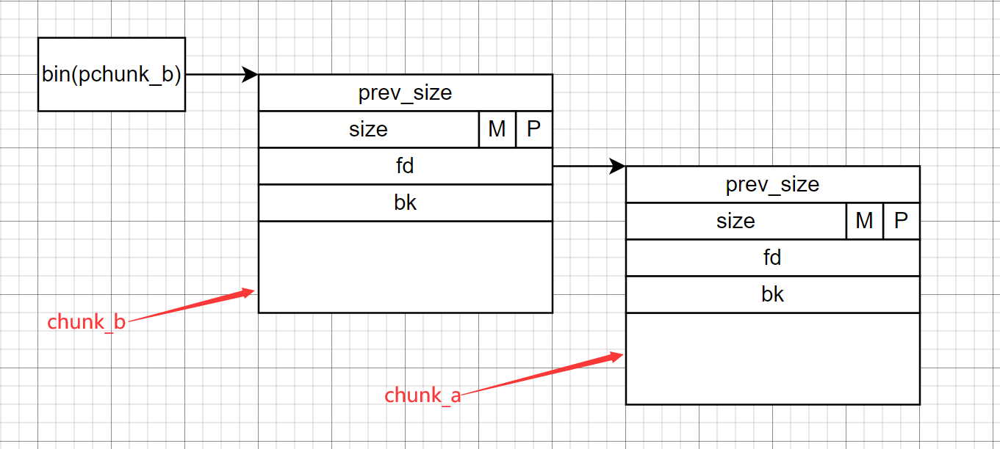
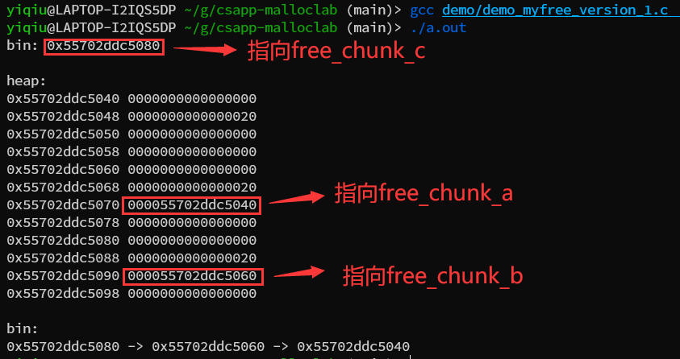

# malloc lab

## 为什么开这个仓库

在github上看了别人写的csapp的malloc lab，总感觉迷迷糊糊，csapp的lab只是叫你写malloc和free之类的内存操作接口，但是并没有直接让你看到内存的布局，编写者对程序是如何工作的也知之甚少，所以看完csapp的malloc lab，我决定自己写一个malloc lab，自己设置一个虚拟的内存，自己操作这块内存，自己测试程序的运行状况

## 设置虚拟内存

（有关malloc的代码都将分布在mymalloc.h中，测试mymalloc.h的代码分布在demo.c中）

```c
#define MAX_MEM_SIZE 1000000

uint8_t MEMORY[MAX_MEM_SIZE] = {0}; 
```

首先分配一个全局数组，uint8_t刚好是char类型的长度，数组的大小就是1000000字节，用这个数组来模拟内存，稍后，我们的heap将从这片虚拟的内存中分配

# heap

```c
uint8_t *pstart, *pend;

void heap_init()
{
    pstart =  MEMORY;
    pend   = &MEMORY[4096];
}
```

首先定义了两个全局指针，pstart和pend，pstart指向heap的开始位置，pend指向heap结束位置的后一个字节，pend并不属于heap区域，heap区域是pstart到pend-1之间的区域

heap_init函数用于初始换heap区域，heap的起始位置与MEMORY重叠，heap的初始区域是MEMORTY下标0~4095这块4096字节大小的区域

heap应该是可以调节大小的，在ptmalloc中使用sbrk函数来调节heap区域的大小

sbrk函数原型：

```c
void* sbrk(intptr_t increment);
```

参数increment是一个整数（可以是负数），用于与heap末位置相加来调整heap的大小，函数的返回值是上一次heap的末位置，所以如果increment是0，则会获取当前heap末位置的指针

由此，定义我们自己的sbrk函数：

```c
void* mysbrk(int increment)
{
    void* pret = pend;
    pend += increment;
    return pret;
}
```

测试heap：

demo_heap.c

```c
#include<stdio.h>
#include"mymalloc.h"

int main()
{
    heap_init();
    printf("origin heap:\n");
    printf("pstart: %p\npend: %p\nheap_size: %ld\n", pstart, pend, pend-pstart);
    
    printf("\nadd 10 bytes:\n");
    mysbrk(10);
    printf("pstart: %p\npend: %p\nheap_size: %ld\n", pstart, pend, pend-pstart);

    printf("\nsub 5 bytes\n");
    mysbrk(-5);
    printf("pstart: %p\npend: %p\nheap_size: %ld\n", pstart, pend, pend-pstart);

    return 0;
}
```



看起来一切正常

# chunk

在ptmalloc中，每次分配出来的内存称为chunk，chunk的结构如下：



每个chunk的开头都有两个dword，第一个dword是prev_size，记录上一个chunk的size，第二个dword是size，记录本chunk的大小，size字段的最低两个bit，一个是M，代表这个chunk是否是mmap()函数分配的，另一个是P，代表当前chunk是否处于使用状态（为什么可以复用这两个bit的原因将在后文解释），开头的两个字之后就是用户可以使用的区域了，也就是data区域，

是否是mmap()分配的好理解，每次我们调用malloc时，都会传递一个表示申请内存大小的size作为参数，当这个参数在一定范围内时，malloc是从heap中分配内存来返回给用户使用，但是当size超出这个范围时，可能是因为heap不够大，也可能是为了提高内存利用率（大块内存直接由操作系统可以提高内存的利用率，减少内存碎片的产生），这块内存将由mmap分配，由mumap释放，分配和释放都是直接由操作系统进行，M为1时表示这块chunk是由mmap分配的，为0时表示不是由mmap分配的（在我们的实现中将不考虑mmap）

是否处于使用状态又是什么意思？

前面提到过，mmap分配的内存直接由操作系统管理，mumap之后直接返还给操作系统，但是如果一块内存不是mmap分配的，那么这块内存将由堆管理器管理，free掉这块内存后，不会直接归还给操作系统，堆管理器会将其统一管理起来，这些内存仍然以chunk的形式存在，但是free掉之后，我们就称其为free chunk，没有被free的chunk就是正在处于使用状态的chunk，他的P标志位会被设置为1，free chunk的P标志位则是0

那么为什么可以复用size的最低两个bit呢？

因为在32位机器上，chunk的size默认是16的整数倍，在64位机器上，chunk的size默认32的整数倍，那么chunk的size必定是8的整数倍，8的二进制表示为1000，最后三个bit永远是0，不会被使用到，所以可以复用size字段的最低两个bit

当chunk处于使用状态时，chunk的data字段可能时垃圾数据，也可能是用户填充的数据，当chunk被free之后，chunk就变成了free chunk，free chunk的data字段的前两个dword是有意义的（由堆管理器设置），如图：



fd是一个指针，指向上一个free chunk

bk是一个指针，指向下一个free chunk

可能有人现在已经懵了，什么上一个chunk的size，什么指向上一个free chunk

首先明确一点，chunk不等与free chunk

chunk也可能是正在被使用的chunk，malloc分配出一个chunk之后，他就是chunk，正在被使用的chunk

free一个正在被使用的chunk后，它还是chunk，但是是free chunk

chunk包含了inuse chunk和free chunk

还有一点就是，chunk是物理连续的，但free chunk不一定物理连续

chunk是堆中一个个物理相邻的内存块，堆管理器保证chunk是物理相邻的


free chunk是bin中的双向链表：



显而易见的是：不可能所有的free chunk都是物理相邻的，因为它们中间还分布着inuse chunk，所以堆管理器将所有free chunk的信息保存到bin中（free chunk的实体仍然在heap中），为什么要将free chunk的信息收集起来？这样做的目的后面再说

我们现在要做的就是：

1. 调用mallo时，在heap中创建chunk
2. 调用free时，将free chunk的信息保存到bin中（为什么是bin？如果ptmalloc是我写的，我叫它shit都行）


我们每次创建chunk都是紧跟在已创建的chunk之后，所以为了方便的找到这个位置，我们定义一个ptop_chunk指针指向已分配的chunk的末尾，那么显然，我们每次创建chunk都相当于是在切割堆中剩余的空间，我们不妨给这块空间起一个名字，叫top chunk（其实这就是规范的叫法）


```c
uint8_t* ptop_chunk;
```

一开始，heap中没有chunk，所以这时ptop_chunk应该指向heap的起始位置，也就是pstart

向heap_init中添加代码：

```c
void heap_init()
{
    pstart =  MEMORY;
    pend   = &MEMORY[4096];
    ptop_chunk = pstart;
}
```

## 实现第一版mymalloc

mymalloc接收一个参数，然后根据这个size在heap中分配chunk

首先，用户并不会关心chunk是什么，用户需要的是size大小的内存来存放数据，所以chunk的size不应该等于用户要求的size，chunk_size应该还要加上chunk的头部，其次，我们之前提到过，64位模式下，size必须是16的整数倍，如果用户请求17个字节，那么chunk的大小因该是：

16(chunk_header) + 17(request_size) + 15(padding) = 48

15个字节的填充保证了chunk的size为16的倍数（在ptmalloc中其实并非如此，这只是第一版，我会在后面进行改进，实际是用户请求17个字节，chunk的大小将是32个字节）

我们可以这样计算chunk的size：（暂时认为这是正确的吧！）

你可能会想到int64_t会发生溢出，但其实在ptmalloc中，如果申请的size过大，mmap将代替堆管理器工作，但是我们的malloc中不涉及mmap，那就默认用户请求的size不会造成溢出吧

```c
int64_t chunk_size = (size + 16) + (size % 16 ? 16 - (size%16) : 0);
```

接着就是在heap中布置chunk结构了，我们需要设置的只有chunk的头部，data字段将由用户自行填充

而在chunk_header中，我们当前需要设置的只有size，prev_size是上一个chunk的size，我们在分配这个chunk时，是无法的知上一个chunk的size的，ptmalloc使用了巧妙地方法在其他地方设置prev_size，在这里我们就暂且不设置prev_size，然后就是P标志位（表示chunk是否处于使用状态），当前，我们的malloc每次都是从top_chunk中切割chunk，在这种情况下，我们总是将P标志位置为1，你可能会想：将P置为1是否代表top_chunk的前一个chunk总是inuse？

答案是肯定得，但是以现在的代码来解释这个断言是没有道理的，在后面我们将完善代码，使之更像ptmalloc，那是，我再来解释为什么top_chunk的前一个chunk必定使inuse的

定义一个打包函数，可以将chunk_size和P标志位打包

```c
typedef enum p {free, inuse} P;

/*
 * 将size和P打包
 */
int64_t pack(int32_t size,  P statu)
{
    return size | statu;
}
```

将打包后的数值放入size字段：

size字段使chunk的第二个dword

```c
*((int64_t*)(ptop_chunk) + 1) = pack(chunk_size, inuse);
```

然后将ptop_chunk加上chunk_size，并返回指向data字段的指针

```c
void* ret = (void*)ptop_chunk + 16;
ptop_chunk += chunk_size;
return ret;
```

最后，考虑一下特殊情况，当mallo第一个chunk是，因为第一个chunk前面不会有chunk，所以我们可以将prev_size设为0

定义一个全局变量表示chunk的数量

```c
//chunk的数量
unsigned chunk_num = 0;
```

如果是第一个chunk，将prev_size置为0

```c
if (chunk_num == 0)
    {
        *(int64_t*)ptop_chunk = 0;
    }
```

第一版mymalloc完整代码

```c
void* mymalloc(int64_t size)
{
    //不合法的size
    if (size <= 0)
    {
        return NULL;
    }
    //计算chunk的size
    int64_t chunk_size = (size + 16) + (size % 16 ? 16 - (size%16) : 0);

    //在heap中布置chunk结构
    *((int64_t*)(ptop_chunk) + 1) = pack(chunk_size, inuse);

    //如果是第一个chunk
    if (chunk_num == 0)
    {
        *(int64_t*)ptop_chunk = 0;
    }
    chunk_num++;

    void* ret = (void*)(ptop_chunk + 16);
    ptop_chunk += chunk_size;
    return ret;
}

```

## 测试第一版mymalloc

demo_mymalloc_version_1.c

```c
#include<stdio.h>
#include"mymalloc.h"

int main()
{
    heap_init();

    int* pchunk1 = (int*)mymalloc(sizeof(int));

    int* pchunk2 = (int*)mymalloc(sizeof(int));

    char* pchunk3 = (char*)mymalloc(sizeof(char) * 8);

    char* pchunk4 = (char*)mymalloc(sizeof(char) * 17);

    int* pchunk5 = (int*)mymalloc(sizeof(int) * 5);

    printf("patsrt: %p\n", pstart);

    printf("\nchunk1: %p\n", pchunk1);
    printf("chunk2: %p\n", pchunk2);
    printf("chunk3: %p\n", pchunk3);
    printf("chunk4: %p\n", pchunk4);
    printf("chunk4: %p\n", pchunk5);

    printf("\nheap:\n");
    for (int i = 0; i < (ptop_chunk-pstart)/8; i++)
    {
        printf("%p %016lx\n", ((int64_t*)pstart)+i, *(((int64_t*)pstart)+i));
    }

    return 0;
}
```

测试5次malloc后heap中的内存分布，红色的框框是chunk头，箭头指向的是chunk的数据段

从测试来看，基本满足我们的要求



## 第一版free

free接收一个指针作为参数，free做两件事：

1. 将P位置置为free
2. 将free后的chunk放入bin中

现在，我们将bin设置为单向链表，这是最简单的链表，也是ptmalloc中fastbin使用的结构，在之后我们会使用更加复杂的结构

首先，定义两个函数快速转换pdata和pchunk

```c
void* pdata2pchunk(void* pdata)
{
    return (void*)((uint8_t*)pdata-16);
}

void* pchunk2pdata(void* pchunk)
{
    return (void*)((uint8_t*)pchunk+16);
}
```

pdata是指向chunk中数据字段的指针，是返回给用户的指针

pchunk是指向chunk开头的指针，也就是指向prev_size字段

定义一个bin头指针

```c
//bin头指针
intptr_t* bin;
```

第一版myfree函数

```c
void myfree(void* pdata)
{
    //获取指向chunk头部的指针
    void* pchunk = pdata2pchunk(pdata);
    //将P标志位置为free
    *((int64_t*)pdata-1) &= ~0x1;
    
    if(bin == NULL) //如果bin中没有chunk
    {
        bin = (intptr_t*)pchunk;
        *(intptr_t*)pdata = 0;
    }
    else //bin中有chunk
    {
        *(intptr_t*)pdata = (intptr_t)bin; //将前一个bin保存到这一个chunk的fd字段
        bin = (intptr_t*)pchunk; //将这一个chunkd
    }
}

```



一开始，bin里面什么都没有



执行完依次free之后，bin中存放的是指向chunk_a的指针，这个指针指向了chunk_a，并且chunk_a的fd指针被置为0



执行完第二次free之后，bin中保存的是指向chunk_b的指针，而不再是chunk_a的指针了，我们也不必担心chunk_a会丢失，此时chunk_b的fd字段保存的是pchunk_a，所以它会指向chunk_a

后面的free以此类推

## 测试第一版myfree

demo_myfree_version_1.c

```c
#include<stdio.h>
#include"../mymalloc.h"

int main()
{

    heap_init();
    int* a = (int*)mymalloc(sizeof(int));
    int* b = (int*)mymalloc(sizeof(int));
    int* c = (int*)mymalloc(sizeof(int));

    *a = 1;
    *b = 2;
    *c = 3; 

    myfree(a);
    myfree(b);
    myfree(c);

    printf("bin: %p\n", bin);

    printf("\nheap:\n");
    for (int i = 0; i < (ptop_chunk-pstart)/8; i++)
    {
        printf("%p %016lx\n", ((int64_t*)pstart)+i, *(((int64_t*)pstart)+i));
    }

    printf("\nbin:\n");

    intptr_t* pItem = bin;
    intptr_t fd = *(intptr_t*)pchunk2pdata(pItem);
    while(fd != 0)
    {
        printf("%p -> ", pItem);
        pItem = (intptr_t*)(fd);
        fd = *(intptr_t*)pchunk2pdata(pItem);
    }
    printf("%p\n", pItem);

    return 0;
}
```



从内存布局也可以看出：

bin指向chunk_c，chunk_a的fd指向chunk_b，chunk_b的fd指向chunk_a
